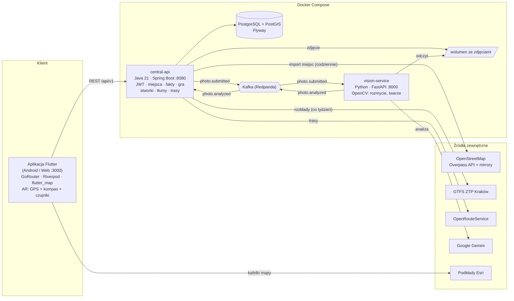

<div align="center">

# ♿ ClearPath · Kraków bez barier

**Mapa dostępności i tłumów dla Krakowa — z grą w łapanie stworków, która motywuje do jej uzupełniania.**


</div>

---

## 📌 O projekcie

ClearPath pomaga osobom poruszającym się na **wózkach inwalidzkich** i **rodzicom z wózkami dziecięcymi** ocenić, czy miejsce lub trasa w Krakowie są dla nich przejezdne — według **ich własnych progów** (schody, krawężnik, szerokość przejścia, nachylenie), a nie jednego hasła „dostępne / niedostępne”.

Jednocześnie aplikacja **rozprasza ruch turystyczny**: pokazuje, gdzie jest tłoczno, i prowadzi trasami omijającymi tłumy.

Zasady, których się trzymamy:

- każda informacja ma **źródło, datę i poziom wiarygodności**,
- **brak danych nigdy nie oznacza „dostępne”**,
- korzystamy **wyłącznie z otwartych źródeł** — bez pobierania danych bez zgody dostawcy,
- profil potrzeb zostaje **tylko na urządzeniu**, aplikacja nie pyta o niepełnosprawność.

> ⚠️ Prototyp hackathonowy. Dane oznaczone **„DANE PRZYKŁADOWE”** są demonstracyjne i nie opisują rzeczywistego stanu obiektów.

---

## ✨ Funkcje

### 🗺️ Dostępność
- **Profil potrzeb** — wózek inwalidzki, wózek dziecięcy albo własne progi.
- **Ocena miejsc dla profilu**: Pasuje / Częściowo / Nie pasuje / Za mało danych.
- **Karta miejsca** — bariery i udogodnienia ze źródłem, datą, wiarygodnością i ostrzeżeniem o sprzecznych danych; potwierdzanie i kwestionowanie faktów.
- **Lista miejsc** — tekstowa alternatywa mapy z wyszukiwaniem i filtrami.
- **Trasy** (OpenRouteService) — trasa piesza z zaznaczonymi barierami dla profilu oraz alternatywa dla wózka.

### 👥 Tłumy
- **Siatka sześciokątów ~100 m** nad centrum Krakowa.
- **Szacowanie z otwartych danych**: miejsca z OpenStreetMap (kategoria, godziny otwarcia), odjazdy komunikacji z GTFS ZTP Kraków, sezonowość.
- **Korekta na żywo**: ankiety „Jak tłoczno?” i anonimowa aktywność w aplikacji (od 3 osób).
- **Chmura zatłoczenia** na mapie i filtr **„Unikaj tłumów”** w trasach.

### 🐉 Grywalizacja
- **Stworki na mapie** w miejscach dostępnych dla pieszych.
- **Łapanie w AR** — GPS, kompas i czujniki orientacji; tylko w pobliżu stworka.
- **Zdjęcie bariery = złapanie** — analiza w tle, powiadomienie o wyniku, zakładka *Zgłoszenia*.
- **Rzadkość** (zwykły → legendarny) zależy od wagi bariery; **kolekcja**, sprzedaż za punkty, **vouchery** ważne 2 h.

### ♿ Dostępność samej aplikacji
- Etykiety dla czytników ekranu, kontrast zgodny z WCAG.
- Tryb **offline** na danych demonstracyjnych.

---

## 🏗️ Architektura



| Komponent | Technologie | Rola |
|---|---|---|
| `mobile/` | Flutter, Riverpod, GoRouter, flutter_map | Mapa, profil, trasy, AR, zgłoszenia, kolekcja, nagrody |
| `services/central-api/` | Java 21, Spring Boot, Flyway, Spring Kafka | REST API, logika gry, import danych, model tłumów |
| `services/vision-service/` | Python, FastAPI, OpenCV, aiokafka, Gemini | Analiza zdjęć: rozmycie, twarze, ocena barier |
| PostgreSQL + PostGIS | PostGIS 3.4 | Dane przestrzenne, fakty, punkty, stworki, siatka tłumów |
| Redpanda | API Kafki | Kolejka `photo.submitted` → `photo.analyzed` |

Więcej schematów (przepływ zdjęcia, model tłumów): **[ARCHITEKTURA.md](ARCHITEKTURA.md)**.

---

## 🚀 Uruchomienie

### Docker (zalecane)

**Wymagania:** [Docker Desktop](https://www.docker.com/products/docker-desktop/) lub Docker Engine z Compose v2, ok. 6 GB wolnego miejsca, wolne porty `3000`, `8080`, `8000`, `5432`, `19092`.

```bash
git clone <adres-repozytorium> clearpath
cd clearpath
cp .env.example .env          # PowerShell: Copy-Item .env.example .env
docker compose up --build
```

Pierwsze uruchomienie trwa kilka–kilkanaście minut (budowa obrazów Java, Python i Flutter).

| Co | Adres |
|---|---|
| 📱 Aplikacja (Flutter Web) | http://localhost:3000 |
| 📘 Dokumentacja API (Swagger) | http://localhost:8080/swagger-ui.html |
| 💚 Stan API | http://localhost:8080/health |

Zatrzymanie: `docker compose down` (z `-v` usuwa też bazę i zdjęcia).

### Klucze (`.env`) — wszystkie opcjonalne

| Zmienna | Bez niej |
|---|---|
| `ORS_API_KEY` | trasa jako oznaczona linia prosta |
| `GEMINI_API_KEY` | analiza zdjęć w deterministycznym trybie demo |
| `JWT_SECRET` | losowy sekret przy starcie (tokeny tracą ważność po restarcie) |
| `ADMIN_TOKEN` | brak dostępu do ręcznego importu `/api/v1/admin/import` |
| `CROWD_DEMO` | `true` domyślnie — demonstracyjny kształt tłumów (Stare Miasto) na wypadek braku danych |

### Aplikacja bez Dockera (dla deweloperów)

Wymagania: Flutter 3.41+, Chrome.

```bash
cd mobile
flutter pub get
flutter run -d chrome --dart-define=API_BASE_URL=http://localhost:8080/api/v1
```

Bez `API_BASE_URL` aplikacja działa offline na danych demonstracyjnych.

### Testy

```bash
cd services/central-api && ./gradlew test     # API (JUnit)
cd mobile && flutter test                      # aplikacja
cd services/vision-service && pytest           # analiza zdjęć
```

---

## 📊 Źródła danych i licencje

| Źródło | Do czego | Licencja / warunki |
|---|---|---|
| **OpenStreetMap** (Overpass API + mirrory, lokalna kopia Krakowa jako zapas) | miejsca, tagi dostępności (`wheelchair`, `kerb`, `step_count`, `opening_hours` …), punkty dla stworków | © OpenStreetMap contributors, ODbL |
| **GTFS ZTP Kraków** (`gtfs.ztp.krakow.pl`) | odjazdy tramwajów i autobusów na godzinę — model tłumów | otwarte dane Miasta Krakowa |
| **OpenRouteService** | trasy piesze i dla wózka, schody, nachylenie, nawierzchnia | HeiGIT, darmowy klucz z limitami; dane © OSM |
| **Esri** (World Dark Gray, World Street Map, World Imagery) | podkłady mapy | © Esri, HERE, Garmin, Maxar, OSM — wymagana atrybucja |
| **Google Gemini** | wstępna ocena barier na zdjęciach | wynik oznaczany „AI · niezweryfikowane” |
| **Zgłoszenia użytkowników** | fakty o barierach, potwierdzenia, ankiety o tłoku | niezweryfikowane do czasu potwierdzenia |
| **Sezonowość** (ogólny kształt wg GUS / MOT) | mnożnik miesięczny w modelu tłumów | heurystyka, dane nie są pobierane |

Nie korzystamy z danych pobieranych bez zgody dostawcy (np. Google Popular Times). Wagi kategorii i profile godzinowe w modelu tłumów to nasze heurystyki, nie pomiary.

---

## 📁 Struktura repozytorium

```
mobile/                    aplikacja Flutter (Android / Web)
services/central-api/      Java 21 · Spring Boot · PostGIS — centralne API
services/vision-service/   Python · FastAPI · OpenCV · Gemini — analiza zdjęć
docs/                      specyfikacja, plan etapów, backend, prezentacja
docker-compose.yml         cały system jednym poleceniem
ARCHITEKTURA.md            schematy architektury i źródła danych
OPIS_PROJEKTU.txt          krótki opis projektu
```

## 📚 Dokumentacja

- Architektura i źródła: [ARCHITEKTURA.md](ARCHITEKTURA.md)
- Specyfikacja techniczna: [docs/TZ.md](docs/TZ.md) / [docs/TZ.pdf](docs/TZ.pdf)
- Backend (encje, API, Kafka): [docs/BACKEND.md](docs/BACKEND.md)
- Plan etapów: [docs/ETAPY.md](docs/ETAPY.md)
- Prezentacja: [docs/Prezentacja_MVP.pdf](docs/Prezentacja_MVP.pdf)
- Szczegóły serwisów: [services/central-api/README.md](services/central-api/README.md), [services/vision-service/README.md](services/vision-service/README.md)
